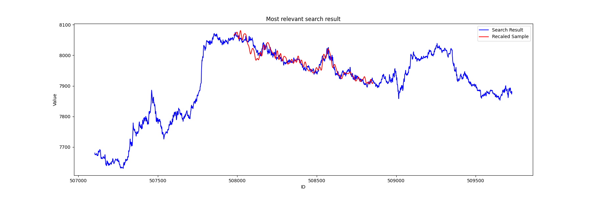

# DATA_ANALYSIS_PYTHON
<div align="center">
    
</div>

## Install requirements
```bash
pip install -r requirements.txt
```

## Setup Environment
```bash
cp .env.example .env
```
## Preprocessing
```bash
python3 preprocess.py
```

## Regist Data
```bash
python3 regist_chromadb_scaled.py
python3 regist_rhymes.py
```
This command make `DB` directory and regist from `data\DATASET_MASTER.xlsx`

## Running Gradio Server
```bash
gradio interface.py
```

